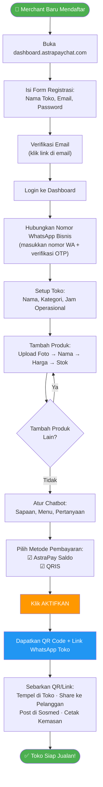
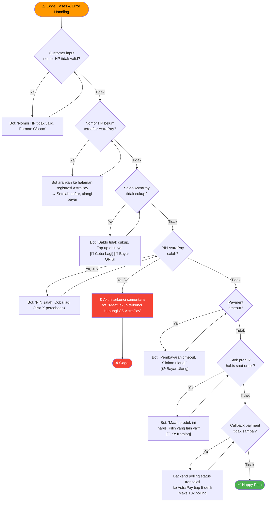
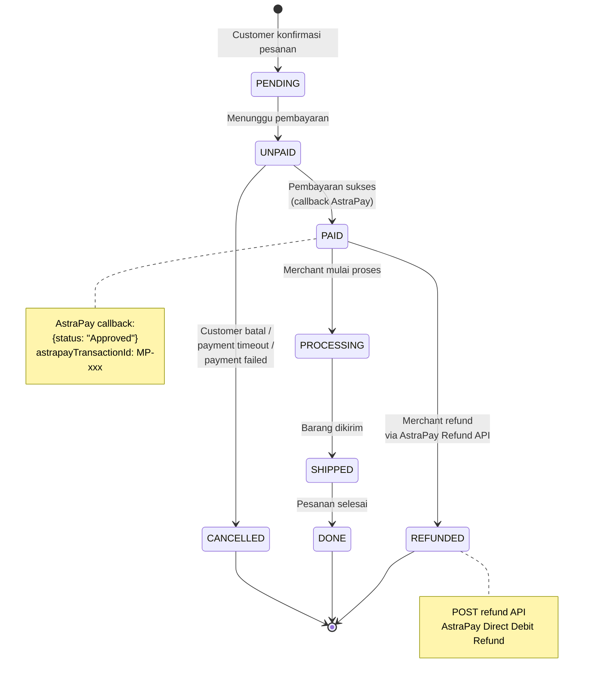
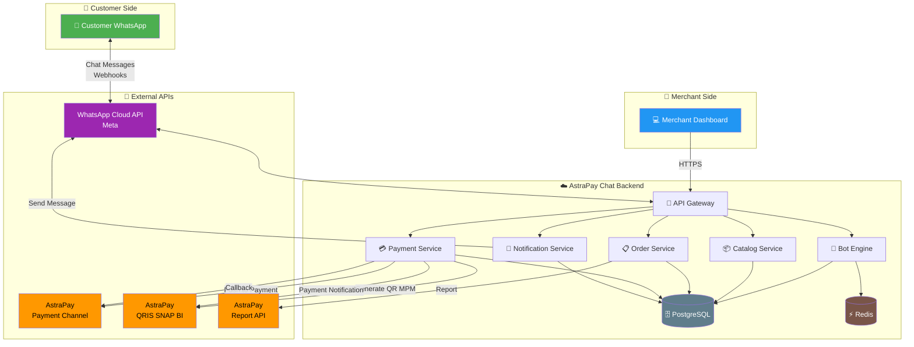
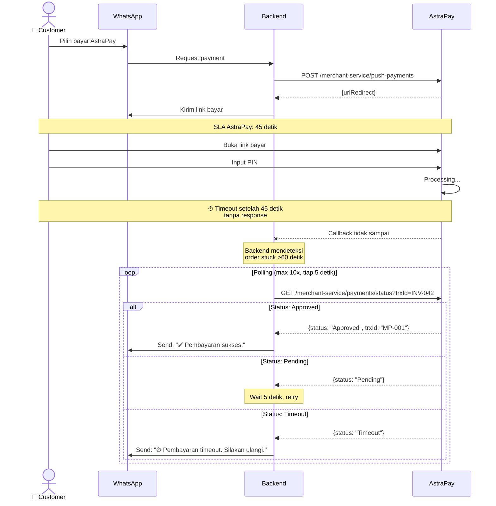
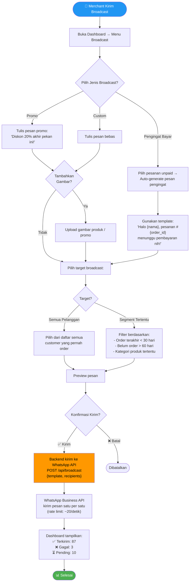
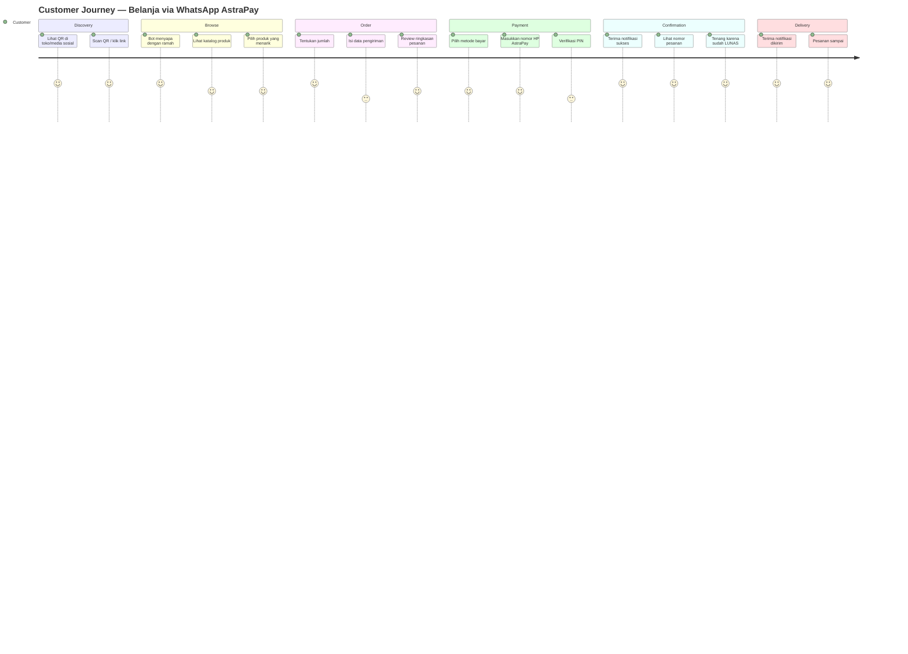
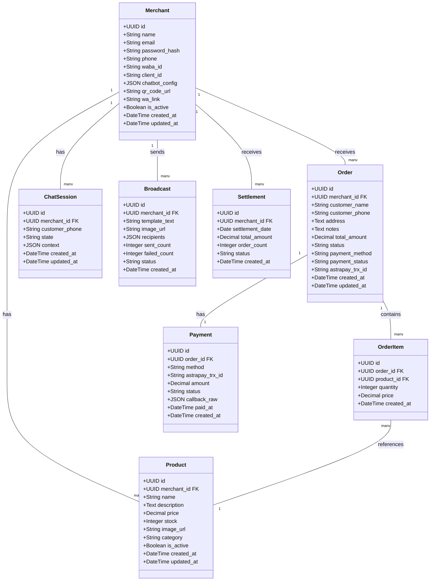

# Mermaid Diagrams — AstraPay Chat

> Semua diagram di bawah bisa langsung copy-paste ke [mermaid.live](https://mermaid.live)
> Format: Mermaid.js

---

## 1. FLOWCHART: Merchant Setup di Dashboard (First Time)

---

## 2. FLOWCHART: Customer End-to-End Order Flow (Happy Path)

```mermaid
flowchart TD
    START(["📱 Customer Scan QR / Klik Link WA"]) --> GREET["Bot WhatsApp Menyapa:<br/>'Halo! Selamat datang di [Nama Toko]'<br/>[🛒 Lihat Produk] [📢 Promo] [❓ Bantuan]"]
    GREET --> CHOOSE{"Customer Pilih?"}
    CHOOSE -->|"🛒 Lihat Produk"| CATALOG["Bot Tampilkan Katalog:<br/>1. Produk A — Rp XX.XXX<br/>2. Produk B — Rp XX.XXX<br/>3. Produk C — Rp XX.XXX<br/>Ketik nomor produk:"]
    CHOOSE -->|"📢 Promo"| PROMO["Bot Tampilkan Promo:<br/>'Diskon 10% produk XYZ!'<br/>[🛒 Ke Katalog]"]
    CHOOSE -->|"❓ Bantuan"| HELP["Bot Tampilkan Bantuan:<br/>Cara Pesan · Pembayaran · Kontak<br/>[🛒 Ke Katalog]"]
    PROMO --> CATALOG
    HELP --> CATALOG

    CATALOG --> SELECT["Customer Ketik Nomor Produk<br/>Contoh: '1'"]
    SELECT --> QTY["Bot: 'Mau berapa?'<br/>Customer: '2'"]
    QTY --> MORE_ITEM{"Bot: 'Tambah produk lain?'<br/>[➕ Tambah] [💳 Bayar]"}

    MORE_ITEM -->|"➕ Tambah"| CATALOG
    MORE_ITEM -->|"💳 Bayar"| COLLECT["Bot Kumpulkan Data:<br/>Nama · Alamat · Catatan"]

    COLLECT --> CONFIRM["Bot Tampilkan Ringkasan Pesanan:<br/>Produk xQty = Total Harga<br/>Nama · Alamat<br/>[✅ Konfirmasi] [❌ Batal]"]
    CONFIRM -->|"❌ Batal"| CANCEL(["❌ Pesanan Dibatalkan"])
    CONFIRM -->|"✅ Konfirmasi"| PAY_METHOD["Pilih Metode Bayar:<br/>[🟣 AstraPay Saldo] [📱 QRIS]"]

    PAY_METHOD -->|"🟣 AstraPay"| ASTRA_FLOW["Bot: 'Masukkan nomor HP AstraPay:'<br/>Customer input nomor HP"]
    PAY_METHOD -->|"📱 QRIS"| QRIS_FLOW["Bot generate QR Code MPM<br/>Tampilkan gambar QR di chat"]

    ASTRA_FLOW --> LINK["Bot kirim link pembayaran AstraPay"]
    LINK --> CLICK["Customer klik link → buka halaman PIN AstraPay"]
    CLICK --> PIN["Customer input PIN AstraPay"]
    PIN --> PIN_VALID{"PIN Valid?"}
    PIN_VALID -->|Ya| ASTRA_SUCCESS
    PIN_VALID -->|Tidak| PIN_RETRY["'PIN salah. Coba lagi (sisa X)'"]
    PIN_RETRY -->|Coba lagi| PIN
    PIN_RETRY -->|Gagal 3x| ASTRA_FAIL(["❌ Pembayaran Gagal"])

    QRIS_FLOW --> SCAN["Customer scan QR via e-wallet / m-banking"]
    SCAN --> QRIS_CONFIRM["Customer konfirmasi bayar di app"]
    QRIS_CONFIRM --> QRIS_VALID{"Bayar Sukses?"}
    QRIS_VALID -->|Ya| ASTRA_SUCCESS
    QRIS_VALID -->|Tidak| QRIS_FAIL(["❌ Pembayaran Gagal"])

    ASTRA_SUCCESS["✅ Pembayaran SUKSES"] --> CALLBACK["AstraPay kirim callback ke Backend<br/>{status: Approved, trxId: MP-xxx}"]
    CALLBACK --> UPDATE["Backend update status order → PAID"]
    UPDATE --> NOTIF["Bot kirim konfirmasi ke Customer:<br/>'✅ Pesanan #INV-042 diterima!<br/>Total: Rp XX.XXX — LUNAS<br/>Estimasi kirim: Besok pagi<br/>Terima kasih! 🙏'"]

    NOTIF --> DASHBOARD["📊 Di Dashboard Merchant:<br/>Order #042 muncul → status PAID<br/>Merchant proses pesanan"]
    DASHBOARD --> SHIP["Merchant update status → DIKIRIM"]
    SHIP --> COMPLETE(["🎉 Pesanan Selesai!"])

    style START fill:#4CAF50,color:#fff
    style COMPLETE fill:#4CAF50,color:#fff
    style ASTRA_SUCCESS fill:#4CAF50,color:#fff
    style CANCEL fill:#f44336,color:#fff
    style ASTRA_FAIL fill:#f44336,color:#fff
    style QRIS_FAIL fill:#f44336,color:#fff
    style DASHBOARD fill:#2196F3,color:#fff
    style CATALOG fill:#FF9800,color:#000
    style CONFIRM fill:#FF9800,color:#000
    style NOTIF fill:#9C27B0,color:#fff
```

---

## 3. SEQUENCE DIAGRAM: Full System Interaction (Merchant Setup → Customer Order → Payment → Settlement)

```mermaid
sequenceDiagram
    actor M as 🏪 Merchant
    actor C as 📱 Customer
    participant D as Dashboard Web
    participant BE as Backend API
    participant DB as Database
    participant WA as WhatsApp API (Meta)
    participant AP as AstraPay API

    %% ===== PHASE 1: MERCHANT SETUP =====
    rect rgb(255, 243, 224)
    Note over M,DB: PHASE 1 — MERCHANT ONBOARDING & SETUP
    M->>D: Buka dashboard.astrapaychat.com
    M->>D: Register (nama, email, password)
    D->>BE: POST /api/auth/register
    BE->>DB: INSERT merchants
    DB-->>BE: OK
    BE-->>D: 201 Created
    D-->>M: "Cek email untuk verifikasi"

    M->>D: Klik link verifikasi
    D->>BE: PUT /api/auth/verify
    BE->>DB: UPDATE merchants SET verified=true
    BE-->>D: OK

    M->>D: Login
    D->>BE: POST /api/auth/login
    BE-->>D: JWT token

    M->>D: Hubungkan nomor WA
    D->>BE: PUT /api/merchants/:id
    BE->>WA: Register WABA / verify number
    WA-->>BE: OK
    BE->>DB: UPDATE merchants SET waba_id, phone
    BE-->>D: OK

    M->>D: Tambah Produk
    D->>BE: POST /api/products
    BE->>DB: INSERT products
    DB-->>BE: OK
    BE-->>D: 201 Created

    M->>D: Atur Chatbot Sapaan
    D->>BE: PUT /api/merchants/:id
    BE->>DB: UPDATE merchants SET chatbot_config
    BE-->>D: OK

    M->>D: Klik AKTIFKAN
    D->>BE: PUT /api/merchants/:id/activate
    BE->>DB: UPDATE merchants SET is_active=true
    BE-->>D: {qr_code_url, wa_link}
    D-->>M: Tampilkan QR Code & Link WA
    end

    %% ===== PHASE 2: CUSTOMER ORDER =====
    rect rgb(227, 242, 253)
    Note over C,BE: PHASE 2 — CUSTOMER ORDER FLOW VIA WHATSAPP
    C->>WA: Scan QR / Klik Link WA
    WA->>BE: POST /api/webhooks/whatsapp<br/>{from: "628xxx", text: "Halo"}
    BE->>DB: SELECT products WHERE merchant.wa_link matches
    DB-->>BE: [product list]
    BE->>DB: INSERT chat_sessions
    BE->>WA: Send message: "Halo! Mau pesan apa?" + catalog menu

    WA->>C: Tampilkan greeting + menu
    C->>WA: "1" (pilih produk pertama)
    WA->>BE: POST /api/webhooks/whatsapp<br/>{from: "628xxx", text: "1"}
    BE->>DB: SELECT product id=1
    DB-->>BE: {name, price, stock}
    BE->>DB: UPDATE chat_sessions SET state='browsing'
    BE->>WA: Send: "Produk A — Rp 50.000. Mau berapa?"
    WA->>C: "Mau berapa?"

    C->>WA: "3"
    WA->>BE: POST /api/webhooks/whatsapp<br/>{text: "3"}
    BE->>BE: Calculate: 3 x 50.000 = 150.000
    BE->>DB: UPDATE chat_sessions SET context={cart: [{id:1, qty:3}]}
    BE->>WA: Send: "Total Rp 150.000. [➕ Tambah] [💳 Bayar]"
    WA->>C: Tampilkan pilihan

    C->>WA: "Bayar"
    WA->>BE: POST /api/webhooks/whatsapp<br/>{text: "Bayar"}
    BE->>DB: UPDATE chat_sessions SET state='collecting'
    BE->>WA: Send: "Nama:"
    WA->>C: "Nama:"
    C->>WA: "Rina"
    WA->>BE: {text: "Rina"}
    BE->>WA: Send: "Alamat:"
    WA->>C: "Alamat:"
    C->>WA: "Jl. Melati No. 5"
    WA->>BE: {text: "Jl. Melati No. 5"}
    BE->>WA: Send: "Catatan (optional):"
    WA->>C: "Catatan:"
    C->>WA: "Packing rapi ya"
    WA->>BE: {text: "Packing rapi ya"}

    BE->>DB: INSERT orders (status=pending, payment=unpaid)
    DB-->>BE: {order_id: "INV-042"}
    BE->>DB: UPDATE chat_sessions SET state='confirm'
    BE->>WA: Send: "✅ Ringkasan Pesanan #INV-042<br/>Produk A x3 = Rp 150.000<br/>Nama: Rina<br/>[✅ Konfirmasi] [❌ Batal]"
    WA->>C: Tampilkan ringkasan
    C->>WA: "Konfirmasi"
    WA->>BE: {text: "Konfirmasi"}
    BE->>WA: Send: "Pilih bayar: [🟣 AstraPay] [📱 QRIS]"
    WA->>C: Pilih metode bayar
    end

    %% ===== PHASE 3: PAYMENT - ASTRA PAY =====
    rect rgb(232, 245, 233)
    Note over C,AP: PHASE 3A — PAYMENT VIA ASTRA PAY (PUSH TO PAYMENT)
    C->>WA: "AstraPay"
    WA->>BE: {text: "AstraPay"}
    BE->>WA: Send: "Masukkan nomor HP AstraPay:"
    WA->>C: "Nomor HP:"
    C->>WA: "081234567890"
    WA->>BE: {text: "081234567890"}

    BE->>AP: POST /merchant-service/push-payments<br/>{merchantTransactionId: "INV-042", amount: "150000"}
    AP-->>BE: {token: "xxx", urlRedirect: "https://sandbox.astrapay.com/..."}
    BE->>WA: Send payment link
    WA->>C: "[Klik di sini untuk bayar]"
    C->>AP: Buka halaman PIN AstraPay
    C->>AP: Input PIN
    AP->>AP: Validasi PIN

    AP->>BE: POST Payment Callback<br/>{merchantTransactionId: "INV-042",<br/>astrapayTransactionId: "MP-001",<br/>status: "Approved", amount: "150000"}
    BE->>DB: UPDATE orders SET status='paid',<br/>astrapay_trx_id='MP-001', payment_status='paid'
    BE->>WA: Send: "✅ Pesanan #INV-042 LUNAS!<br/>Total: Rp 150.000<br/>Terima kasih Rina! 🙏"
    WA->>C: Konfirmasi pembayaran sukses
    end

    %% ===== PHASE 3B: PAYMENT - QRIS (ALTERNATE) =====
    rect rgb(255, 235, 238)
    Note over C,AP: PHASE 3B — PAYMENT VIA QRIS (ALTERNATE FLOW)
    C->>WA: "QRIS" (alternate choice)
    WA->>BE: {text: "QRIS"}
    BE->>AP: POST /snap/v1.0/qr/qr-mpm-generate<br/>{partnerReferenceNo: "INV-042", amount: "150000"}
    AP-->>BE: {qrContent: "000201010212...", qrImage: "base64..."}
    BE->>WA: Send QR code image
    WA->>C: Tampilkan QR Code
    C->>AP: Scan QR via e-wallet / m-banking
    AP->>BE: POST Payment Notification<br/>{originalPartnerRefNo: "INV-042", status: "SUCCESS"}
    BE->>DB: UPDATE orders SET status='paid', payment_status='paid'
    BE->>WA: Send: "✅ Pesanan #INV-042 LUNAS via QRIS!"
    WA->>C: Konfirmasi sukses
    end

    %% ===== PHASE 4: MERCHANT PROCESSING =====
    rect rgb(243, 229, 245)
    Note over M,DB: PHASE 4 — MERCHANT PROSES PESANAN
    M->>D: Buka dashboard → lihat pesanan baru
    D->>BE: GET /api/orders?status=paid
    BE->>DB: SELECT orders WHERE status='paid'
    DB-->>BE: [INV-042: Rina, Produk A x3, Rp 150.000]
    BE-->>D: Order list
    D-->>M: Tampilkan semua pesanan PAID

    M->>D: Klik "Proses" → status: SHIPPED
    D->>BE: PUT /api/orders/INV-042/status<br/>{status: "shipped"}
    BE->>DB: UPDATE orders SET status='shipped'
    BE->>WA: Send: "📦 Pesanan #INV-042 sedang dikirim!"
    WA->>C: Notifikasi pengiriman

    M->>D: Klik "Selesai" → status: DONE
    D->>BE: PUT /api/orders/INV-042/status<br/>{status: "done"}
    BE->>DB: UPDATE orders SET status='done'
    end

    %% ===== PHASE 5: SETTLEMENT =====
    rect rgb(255, 249, 196)
    Note over M,AP: PHASE 5 — SETTLEMENT (H+1)
    AP->>AP: Settlement auto (H+1)
    AP->>M: Dana Rp 150.000 masuk rekening
    M->>D: Buka dashboard → lihat laporan
    D->>BE: GET /api/reports/payments
    BE->>DB: SELECT orders WHERE status='done'
    DB-->>BE: Report data
    BE-->>D: Report
    D-->>M: Download CSV laporan transaksi
    end
```

---

## 4. FLOWCHART: Error & Edge Cases

---

## 5. STATE DIAGRAM: Order Lifecycle

---

## 6. GRAPH: System Architecture Overview

---

## 7. SEQUENCE DIAGRAM: Payment Timeout & Retry Logic

---

## 8. FLOWCHART: Broadcast Message ke Pelanggan

---

## 9. JOURNEY MAP: Customer Experience

---

## 10. CLASS DIAGRAM: Database Entity Relationship

---

*Semua diagram siap copy-paste ke [mermaid.live](https://mermaid.live)*
